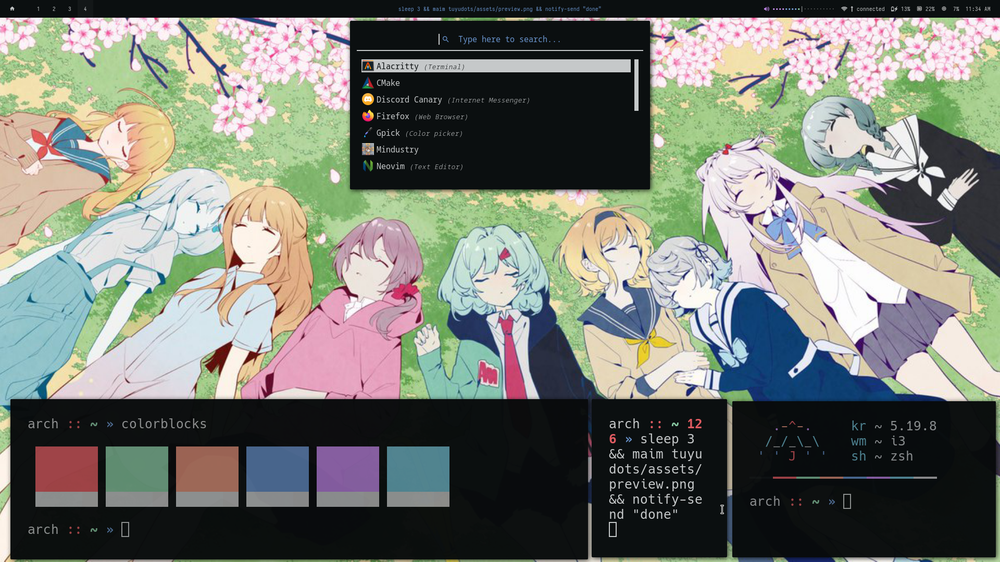

<div align="center">
    <h1><i><samp>ツユ dots</samp></i></h1>
</div>



## <samp>installation</samp>

- arch linux

```sh
sudo pacman -Syu --needed xorg-xinit \
    xorg-server xorg-xsetroot xorg-xrdb i3-gaps \
    alacritty polybar dunst neovim rofi picom \
    zsh hsetroot xdg-utils firefox git xcb-util-xrm \
    libnotify

# optional dependencies
# - tesseract-data-eng (imagetotext "super+i")
# - gpick (color picker "super+p")
# - maim (screenshot "printscr")
# - light (brightness)

# oh-my-zsh for zsh
sh -c "$(curl -fsSL https://raw.github.com/ohmyzsh/ohmyzsh/master/tools/install.sh)"

git clone https://github.com/aishenreemo/tuyudots
cd tuyudots
scripts/install
```

[previous rice](https://github.com/aishenreemo/tuyudots/tree/aca10b83db5cbdf545f2f0e738a347d2a0358489)

## <samp>keybinds</samp>

| key | function |
| :--- | :-------- |
| <kbd>super</kbd> + <kbd>a</kbd> | open app menu |
| <kbd>super</kbd> + <kbd>Enter</kbd> | open terminal |
| <kbd>super</kbd> + <kbd>b</kbd> | open browser (firefox) |
| <kbd>super</kbd> + <kbd>i</kbd> | image to text |
| <kbd>super</kbd> + <kbd>p</kbd> | color picker |
| <kbd>printscr</kbd> | screenshot |
| <kbd>super</kbd> + <kbd>c</kbd> | close window |
| <kbd>super</kbd> + <kbd>tab</kbd> | focus next window |
| <kbd>super</kbd> + <kbd>shift</kbd> + <kbd>f</kbd> | toggle fullscreen |
| <kbd>super</kbd> + <kbd>ctrl</kbd> + <kbd>l</kbd> | toggle layout |
| <kbd>super</kbd> + <kbd>shift</kbd> + <kbd>space</kbd> | toggle floating |
| <kbd>super</kbd> + <kbd>left click</kbd> | move floating window |
| <kbd>super</kbd> + <kbd>right click</kbd> | resize floating window |
| <kbd>super</kbd> + <kbd>1</kbd>-<kbd>5</kbd> | view workspace | 
| <kbd>super</kbd> + <kbd>shift</kbd> + <kbd>1</kbd>-<kbd>5</kbd> | move window to workspace | 
| <kbd>super</kbd> + <kbd>shift</kbd> + <kbd>r</kbd> | restart i3 |
| <kbd>super</kbd> + <kbd>shift</kbd> + <kbd>q</kbd> | quit i3 |

## <samp>acknowledgements</samp>

- [janleigh](https://github.com/janleigh) (inspiration, colorscheme)
- [omutatsu](https://twitter.com/omrice4869) (wallpaper)
