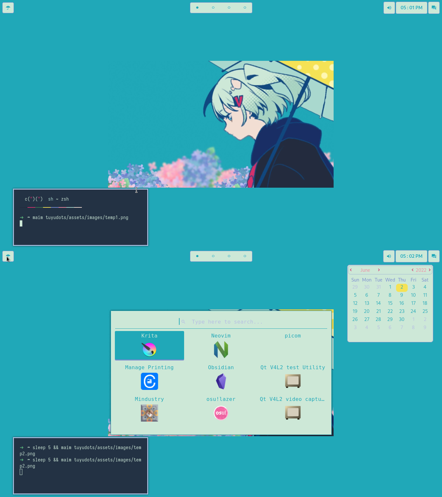

<div align="center">
    <h1><samp>ツユ (TUYU) Dots [WIP]</samp></h1>
    <p>Configuration files to personalize my own system, feel open to browse!</p>
</div>


<br>
<p>Here are the information about my setup:</p>

| **Operating System:**    | [Arch Linux](https://archlinux.org)                 |
| :-------------------:    | :---------------------------------:                 |
| **Window System**        | [X](https://en.wikipedia.org/wiki/X_Window_System)  |
| **Window Manager**       | [bspwm](https://github.com/baskerville/bspwm)       |
| **Terminal Emulator**    | [alacritty](https://github.com/alacritty/alacritty) |
| **Shell**                | [zsh](https://www.zsh.org/)                         |
| **Panel**                | [eww](https://github.com/elkowar/eww)               |
| **Compositor**           | [picom](https://github.com/yshui/picom)             |
| **Editor**               | [neovim](https://github.com/neovim/neovim)          |
| **Application Launcher** | [rofi](https://github.com/davatorium/rofi)          |

## <samp>Installation</samp>

> :warning: Don’t just blindly copy the config files unless you know what that entails. You can fork this repo and remove the things you don't need. Use at your own risk!

- Arch Linux
```sh
# dependencies
sudo pacman -Syu --needed base-devel xorg-xinit xorg-server xorg-xsetroot xorg-xrdb bspwm sxhkd alacritty dunst neovim rofi picom maim alsa-utils alsa-lib alsa-plugins zsh hsetroot xdo xdg-utils

# oh-mh-zsh for zsh
chsh -s $(which zsh)
sh -c "$(curl -fsSL https://raw.github.com/ohmyzsh/ohmyzsh/master/tools/install.sh)"

# tuyudots
git clone https://github.com/aishenreemo/tuyudots
cd tuyudots
scripts/install
```
