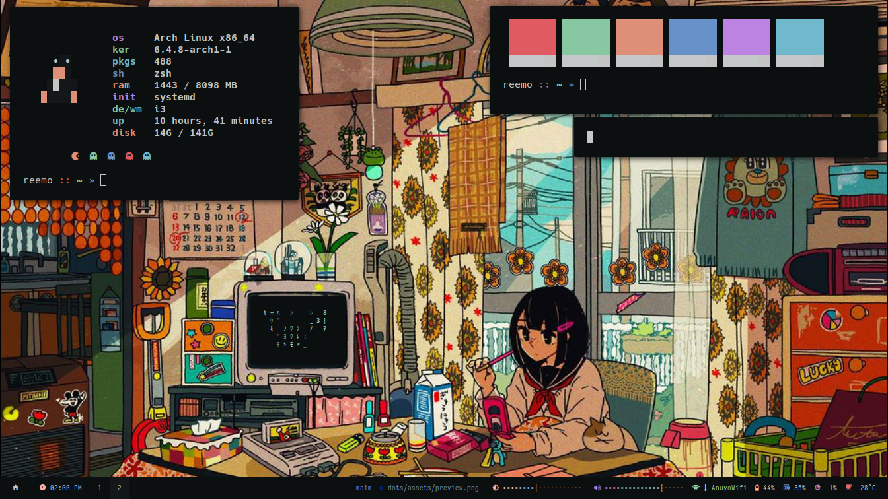

<div align="center">
    <h1><samp>ツユ (TUYU) Dots</samp></h1>
    <p>Configuration files to personalize my own system, feel open to browse!</p>
</div>




## <samp>Keybinds</samp>

| Key | Function |
| --- | -------- |
| Super + a | Open app menu |
| Super + Enter | Open terminal |
| Super + b | Open browser (firefox) |
| Super + i | Image to text |
| Super + p | Color picker |
| Printscr | Screenshot |

| Key | Function |
| --- | -------- |
| Super + c | Close window |
| Super + Tab | Focus next window |
| Super + Shift + f | Toggle fullscreen |
| Super + Ctrl + l | Toggle layout |
| Super + Shift + Space | Toggle floating |
| Super + Left mouse click | Move floating window |
| Super + Right mouse click | Resize floating window |

| Key | Function |
| --- | -------- |
| Super + 1-5 | View workspace | 
| Super + Shift + 1-5 | Move window to workspace | 
| Super + Shift + r | Restart i3 |
| Super + Shift + q | Quit i3 |


## <samp>Installation</samp>

> :warning: Don’t just blindly copy the config files unless you know what that entails. You can fork this repo and remove the things you don't need. Use at your own risk!

- Arch linux
```sh
sudo pacman -Syu --needed xorg-xinit \
    xorg-server xorg-xsetroot xorg-xrdb i3-gaps \
    alacritty polybar dunst neovim rofi picom \
    zsh hsetroot xdg-utils firefox git xcb-util-xrm \
    libnotify

# optional dependencies
# - tesseract-data-eng (imagetotext "super+i")
# - gpick (color picker "super+p")
# - maim (screenshot "printscr")

# oh-my-zsh for zsh
chsh -s $(which zsh)
sh -c "$(curl -fsSL https://raw.github.com/ohmyzsh/ohmyzsh/master/tools/install.sh)"

git clone https://github.com/aishenreemo/tuyudots
cd tuyudots
scripts/install
```

## <samp>Acknowledgements</samp>

- [janleigh](https://github.com/janleigh) (inspiration, lsp configuration and completion for neovim)
- [palette](https://discord.com/users/958246733719167057) (for the wallpaper) 

