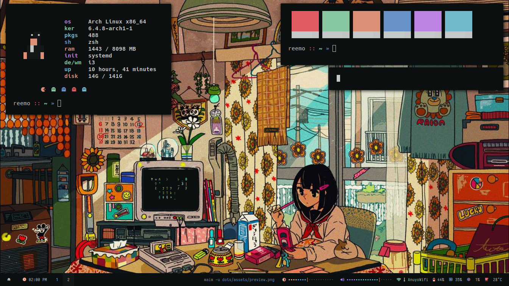

# dots
> A well-tailored working environment isn't just a luxury – it's a key ingredient for boosting productivity.

Hello! These are my dotfiles, AKA how I personalize my computer.



My Linux journey began in 2022, and as a programmer, it was a delightful experience.
Using the Linux landscape, I swiftly adopted a mindset of honing in on what truly counts. 

## software

- [Arch Linux](https://archlinux.org/): Operating System
- [X11](https://en.wikipedia.org/wiki/X_Window_System): Window System

### graphics
- [i3-gaps](https://github.com/Airblader/i3): Window Manager
- [polybar](https://github.com/polybar/polybar): Status Bar
- [dunst](https://github.com/dunst-project/dunst): Notification Daemon 
- [picom](https://github.com/yshui/picom): Compositor

### applications
- [neovim](https://neovim.io/): Text Editor
- [alacritty](https://github.com/alacritty/alacritty): Terminal Emulator
- [rofi](https://github.com/davatorium/rofi): Application Launcher
- [zsh](https://www.zsh.org/): Shell (_oh-my-zsh framework_)

### fonts 
Fonts that are included in this repository. `etc/fonts`
- [Hack](https://github.com/source-foundry/Hack)
- [Material Design Icons](https://github.com/google/material-design-icons)

### icons
Icons that are included in this repository. `etc/icons`
- [Bibata](https://github.com/ful1e5/Bibata_Cursor)

## installation

### automatic
If you want to install everything then run the script `install.sh`. Take note that it will override existing configurations. You still have to install required dependencies with a package manager.

### manual
1. Clone the repository using `git`.
```sh
git clone https://github.com/aishenreemo/dots
```

2. Install paru or any AUR helper you want (optional).
```sh
git clone https://aur.archlinux.org/paru-bin.git
cd paru-bin && makepkg -si
```

3. Install dependencies you need
```sh
paru -S --needed \
    base-devel xorg-xinit xorg-server xorg-xsetroot xorg-xrdb xdg-utils xcb-util-xrm \
    i3-gaps polybar rofi dunst libnotify picom hsetroot alacritty zsh oh-my-zsh \
    maim tesseract-data-eng light pipewire-pulse pavucontrol google-chrome iwd dhcpcd
```

4. Initialize directories.
```sh
mkdir -p ~/.config/
mkdir -p ~/.cache/
mkdir -p ~/.local/bin/
mkdir -p ~/.local/share/fonts
mkdir -p ~/.local/share/icons
```

5. Copy configuration files to their respective paths.
- Fonts
```sh
cp -r dots/etc/fonts/* ~/.local/share/fonts
fc-cache -v
```

- Icons
```sh
cp -r dots/etc/icons/* ~/.local/share/icons
```

- Configuration files
```sh
cp -r dots/cfg/* ~/.config
```

- Binaries
```sh
cp dots/bin/* ~/.local/bin
```

- Misc

```sh
cp dots/etc/misc/.{zshrc,xinitrc,Xresources} ~
```

6. Reboot, login then run `startx`.

## old configurations
Here's a list of my archived old configurations.
1. [`1e732ef`](https://github.com/aishenreemo/dots/tree/1e732ef954dbd08ffe519d8f11ac1a0596d500d9) I am, We are.
2. [`ba19d3f`](https://github.com/aishenreemo/dots/tree/ba19d3fc0e2dbaa752db99e845eea98ebf14c4ad) Bocchi the Rock.
3. [`db8d830`](https://github.com/aishenreemo/dots/tree/db8d83053b5d02dc80ba933cc9417e98ed4d1054) Tuyudots v3.
4. [`aca10b8`](https://github.com/aishenreemo/dots/tree/aca10b83db5cbdf545f2f0e738a347d2a0358489) Tuyudots ft. Bus-chan .
5. [`cbe76cc`](https://github.com/aishenreemo/dots/tree/cbe76cc88a14ee0d4a1256bc95919396c5461a12) Tuyu with themes.

## acknowledgements
- [janleigh](https://github.com/janleigh) (colorscheme)
- [t_oo_r_oo](https://www.instagram.com/t_oo_r_oo/) (wallpaper)
